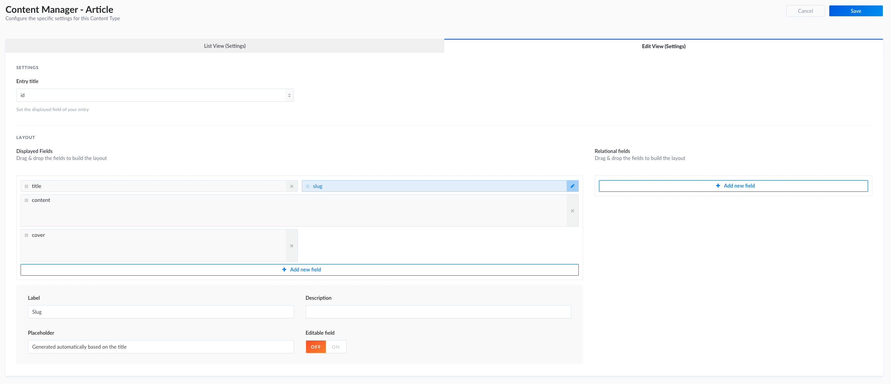

# Create a slug system

This guide will explain how to create a slug system for a Post, Article or any Content Type you want.

## Create attributes

To start building your slug system you need a `string` field as a **base** for your slug, in this example we will use `title`.

You will also need another `string` field that contains the slugified value of your `title`, in this case we will use `slug`.


## Configure the layout for the content editor

Let's configure the layout of the **edit page** to make it more user friendly for the content editor.

- Click on the **Content Manager** link in the left menu.
- Then on the `Article` Content Type.
- And finally on the **Edit View** tab.

Here we will be able to setup the `slug` field.

- Click on the `slug` field.
- At the bottom of the page, edit the **placeholder** value to `Generated automatically based on the title`.
- And click **OFF** for **Editable field** option.
- Don't forget to save your updates.

:::: tabs

::: tab "View before"


:::

::: tab "View after"


:::

::: tab "View configuration"



:::

::::

## Auto create/update the `slug` attribute

For that you will have to install `slugify` node module in your application.

When it's done, you have to update the life cycle of the **Article** Content Type to auto complete the `slug` field.

**Path —** `./api/article/models/Article.js`

:::: tabs

::: tab Mongoose

```js
const slugify = require('slugify');

module.exports = {
  beforeSave: async model => {
    if (model.title) {
      model.slug = slugify(model.title);
    }
  },
  beforeUpdate: async model => {
    if (model.getUpdate().title) {
      model.update({
        slug: slugify(model.getUpdate().title),
      });
    }
  },
};
```

:::

::: tab Bookshelf

```js
const slugify = require('slugify');

module.exports = {
  beforeSave: async (model, attrs, options) => {
    if (options.method === 'insert' && attrs.title) {
      model.set('slug', slugify(attrs.title));
    } else if (options.method === 'update' && attrs.title) {
      attrs.slug = slugify(attrs.title);
    }
  },
};
```

:::

::::

## Fetch article by `slug`

Then you will have to be able to fetch your **Articles** by this slug.

You will be able to find your articles by slug with this request `GET /articles?slug=my-article-slug`
